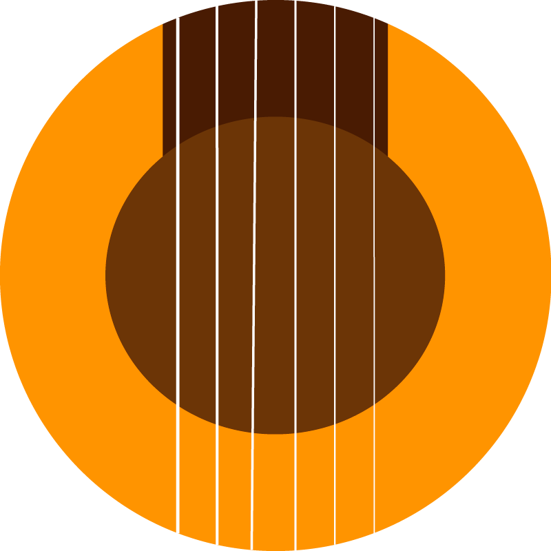

<p align="center">

</p>

# LOLA
[](https://www.python.org/)

[](https://forthebadge.com)
[](https://forthebadge.com)


[](https://opensource.org/licenses/Apache-2.0)


Welcome to my final project made to the context of [CORE School](https://www.corecode.school/).

LOLA is a tool for classifying audios to different flamenco styles ([palo](https://en.wikipedia.org/wiki/Palo_(flamenco))).

### Access the Dashboard for exploring the data [here](https://covid-data-alesanmed.cloud.okteto.net/)

# Table of contents

- [Project and motivation 💃](#motivation)
- [Models used 🪐](#models)
  - [Deep learning 🌌](#deep-learning)
  - [Machine learning 🖨️](#machine-learning)
- [Local deployment 🔨🔧](#local-deployment)
  - [With Docker 🐳](#with-docker)
  - [From source ⛲](#from-source)
- [Dataset Used 📚](#data-used)
- [Future steps](#future)
- [License](#license)

## Project and motivation 💃 <a name="motivation"></a>
Flamenco is an art composed of guitar, singing, and dancing. Its origins come from the XVIII century.

Flamenco is divided into styles, called *palos*. Each of them has different guitar styles, rhythms, as well as lyrics.

Let me illustrate this splitting with an image.


Even this image does not contain all flamenco styles. If you take a look at this one:


There are some styles present only to one of them. All of this is just to illustrate how many different styles are to flamenco.

Even for experienced people, classifying specific audios is hard. That's why I decided to make an expert system for trying to solve this task.

I'm from Andalusia, where flamenco comes from, so contributing in any way to that culture it's a major motivation for me.

## Models used 🪐 <a name="models"></a>

I've used two different approaches to this project. The first is a pure deep learning one, while the latter is a hybrid between a deep learning and a classical machine learning model.

### Deep learning 🌌 <a name="deep-learning"></a>


This approach takes an audio file as input. That audio is split into portions of 10-15 seconds each, with overlapping.

For each sample, a tempogram, spectrogram, and normalized tempogram are extracted. Each of those images is fed into a convolutional neural network. That network recognizes the images and outputs a prediction for each of them.

Finally, the label with more occurrences among all predictions is taken as the final one.

### Machine learning hybrid 👽 <a name="machine-learning"></a>


The second approach is a hybrid process involving a neural network called [VGGish](https://github.com/tensorflow/models/tree/master/research/audioset/vggish), which takes an audio, splits it into samples of 0.9 seconds, and, for each sample, generates a 128-lenght vector of numerical features.

Those vectors are fed into a random forest, which generates a prediction.

## Local deployment 🔨🔧 <a name="local-deployment"></a>

### Docker 🐳 <a name="with-docker"></a>

To deploy this project using Docker, you only have to clone the repository and bring it up with docker-compose.

```
git clone https://github.com/alesanmed/lola.git

cd lola

docker-compose up
```

### From source ⛲ <a name="from-source"></a>

[](https://github.com/alesanmed/lola.git)


If you want to take this path, I recommend:
 1. Clone the repository
 2. Open it to your favorite IDE
 3. Follow the steps to each part's README

## Dataset used 📚 <a name="data-used"></a>

The dataset is a self-built one. I manually selected, split and tagged audio files from three different palos:

- Bulerías
- Alegrías
- Sevillanas

The total dataset is composed by 577 alegrias audios, 589 bulerias and 518 sevillanas.

I've built the largest flamenco dataset on the internet. You can download it from [here](https://zenodo.org/record/5597881)

The dataset structure is:

```
.
├── alegrias
│   ├── 0.mp3
│   ├── 1.mp3
│   ├── ...
│   └── n.mp3
├── bulerias
│   ├── 0.mp3
│   ├── 1.mp3
│   ├── ...
│   └── n.mp3
└── sevillanas
    ├── 0.mp3
    ├── 1.mp3
    ├── ...
    └── n.mp3
```

There is another flamenco dataset available, called [TONAS](https://www.upf.edu/web/mtg/tonas). But there are only 72 acapella audio samples.

## License

[Apache 2.0](LICENSE)
